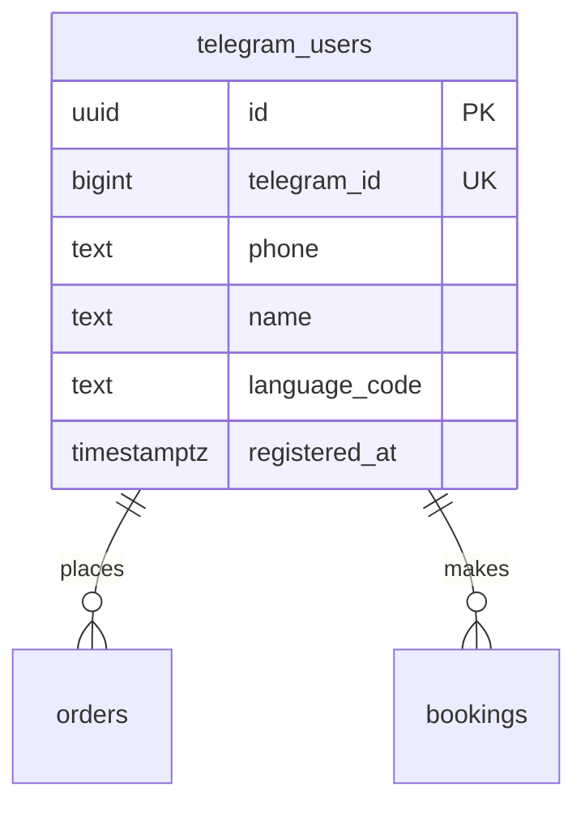

# feat: Telegram Mini App (Menu, Cart, Booking)

## Overview

Adapt the existing Ko'hna Chig'atoy Next.js website to also run as a **Telegram Mini App**. Same codebase, single deployment. Menu browsing and AR work everywhere (browser + Telegram). Ordering (visual cart) and booking are Telegram-only features gated behind one-time registration via contact sharing.

## Problem Statement

Currently the website is browse-only — no ordering or booking. The bot has text-based ordering but UX is poor (reply with numbers, no images). By embedding the website as a Mini App, we get a visual ordering experience inside Telegram with verified identity via contact sharing.

## Proposed Solution

Detect `window.Telegram.WebApp` at runtime. Conditionally show cart/booking UI only inside Telegram. Use Telegram's native contact sharing for registration. POST orders/bookings to new API routes that validate `initData` server-side.

## Technical Approach

### Architecture

```
Browser user → Next.js site → Menu browsing only (same as now)
                                  ↓
Telegram user → Same Next.js site in WebView
                  ↓ detects Telegram.WebApp
                  → Menu + Cart + Booking
                  → Registration gate (contact share + name)
                  → /api/telegram/* routes (validate initData, save to Supabase)
                  → Admin notified via Telegram Bot API
```

### New Database Table

```sql
-- supabase/migrations/002_telegram_users.sql
CREATE TABLE telegram_users (
  id UUID PRIMARY KEY DEFAULT gen_random_uuid(),
  telegram_id BIGINT UNIQUE NOT NULL,
  phone TEXT NOT NULL,
  name TEXT NOT NULL,
  language_code TEXT,
  registered_at TIMESTAMPTZ DEFAULT now()
);
CREATE INDEX idx_telegram_users_tid ON telegram_users(telegram_id);
```

### ERD (additions only)



---

## Implementation Phases

### Phase 1: Telegram Context Layer

**Goal:** Detect Telegram environment, expose it app-wide.

**New files:**
- `src/telegram/TelegramProvider.tsx` — React context provider
  - Detects `window.Telegram.WebApp` on mount
  - Calls `WebApp.ready()`, `WebApp.expand()`
  - Reads `initDataUnsafe.user` for `telegram_id`, `first_name`, `language_code`
  - Checks registration status via `/api/telegram/check-registration`
  - Exposes `{ isTelegram, user, isRegistered, rawInitData }`
  - Sets header/background color: `WebApp.setHeaderColor('#3D261A')`, `WebApp.setBackgroundColor('#FAF6F0')`
  - Auto-detects language from `language_code` if no prior preference stored

- `src/telegram/types.ts` — TelegramUser type, WebApp type declarations

**Modified files:**
- `src/app/layout.tsx:80` — Add Telegram WebApp script tag + wrap with `TelegramProvider`
  ```html
  <script src="https://telegram.org/js/telegram-web-app.js" />
  ```
  ```tsx
  <TelegramProvider>
    <LanguageProvider>{children}</LanguageProvider>
  </TelegramProvider>
  ```

- `src/i18n/LanguageContext.tsx:26-34` — On first load, if no stored locale AND Telegram `language_code` is available, use it as initial locale (map `ru` → `ru`, `en` → `en`, default → `uz`)

**Acceptance criteria:**
- [x]`useTelegram().isTelegram` returns `true` inside Telegram WebView, `false` in browser
- [x]`useTelegram().user` contains telegram_id and first_name when in Telegram
- [x]WebApp script loads without breaking the regular website
- [x]Language auto-detects from Telegram on first visit

---

### Phase 2: initData Validation + Registration API

**Goal:** Secure server-side validation and user registration.

**New files:**
- `src/lib/validateInitData.ts` — HMAC-SHA256 validation
  - Parse initData query string
  - Remove `hash`, sort remaining pairs alphabetically, join with `\n`
  - `secret_key = HMAC-SHA256("WebAppData", BOT_TOKEN)`
  - `computed = HMAC-SHA256(secret_key, data_check_string)`
  - Compare with `crypto.timingSafeEqual`
  - Reject if `auth_date` > 1 hour old
  - Return `{ valid, user, error }`

- `src/app/api/telegram/check-registration/route.ts` — GET
  - Validates initData from header
  - Queries `telegram_users` by `telegram_id`
  - Returns `{ registered: boolean, user?: { name, phone } }`

- `src/app/api/telegram/register/route.ts` — POST
  - Validates initData
  - Accepts `{ phone, name }` from `requestContact()` response
  - Inserts into `telegram_users`
  - Returns `{ success: true, user }`

**Modified files:**
- `.env.local.example` — Add `TELEGRAM_BOT_TOKEN` (needed by Next.js now, not just bot)

**New migration:**
- `supabase/migrations/002_telegram_users.sql` — Create table as shown above

**Acceptance criteria:**
- [x]Valid initData passes validation, forged data is rejected
- [x]Registration creates a `telegram_users` row with verified phone
- [x]Duplicate registration (same telegram_id) returns existing user, no error
- [x]initData older than 1 hour is rejected

---

### Phase 3: Cart System (Client-Side)

**Goal:** Visual cart with add/remove/checkout flow.

**New files:**
- `src/telegram/CartProvider.tsx` — React context + useReducer
  - Actions: `ADD_ITEM`, `REMOVE_ITEM`, `UPDATE_QUANTITY`, `CLEAR`, `HYDRATE`
  - State: `items: CartItem[]`, `total: number`, `itemCount: number`
  - Persists to localStorage on every change, hydrates on mount
  - `CartItem`: `{ id, name, price, quantity }`

- `src/telegram/CartButton.tsx` — Floating cart button OR Telegram MainButton integration
  - Shows item count badge + total price
  - Uses `WebApp.MainButton` API: `MainButton.setText('Cart (3) — 150 000 UZS')`, `MainButton.show()`
  - Tapping MainButton navigates to checkout view
  - Uses `WebApp.HapticFeedback.impactOccurred('light')` on add-to-cart

- `src/telegram/CheckoutSheet.tsx` — Cart summary + confirm
  - Lists all cart items with +/- quantity controls
  - Shows total
  - "Confirm Order" button
  - On confirm: POST to `/api/telegram/order`
  - Success: show confirmation, clear cart, haptic `notificationOccurred('success')`
  - Error: show error message with retry

**Modified files:**
- `src/app/layout.tsx` — Wrap with `CartProvider` (inside TelegramProvider)
- `src/components/MenuCard.tsx` — Add "+" button visible only when `isTelegram`
  - Triggers registration gate if `!isRegistered`
  - Adds item to cart if registered
- `src/app/menu/MenuPageClient.tsx` — Add cart state awareness, show checkout when triggered

**Acceptance criteria:**
- [x]"+" button appears on menu cards only inside Telegram
- [x]Items added to cart persist across page navigations
- [x]Cart survives Mini App close/reopen (localStorage)
- [x]Quantity controls work (increment/decrement/remove at 0)
- [x]Total updates correctly
- [x]MainButton shows cart summary text

---

### Phase 4: Registration Gate UI

**Goal:** Smooth contact sharing + name input flow.

**New files:**
- `src/telegram/RegistrationGate.tsx` — Modal component
  - Step 1: Explain why contact is needed ("To place orders, we need your phone number for confirmation")
  - "Share Contact" button calls `WebApp.requestContact()`
  - If denied: show friendly message + "Try Again" + "Cancel" buttons
  - Step 2: Name input (pre-filled with `user.first_name` from Telegram)
  - "Confirm" sends to `/api/telegram/register`
  - On success: marks `isRegistered = true`, proceeds to original action (add to cart or booking)

**Acceptance criteria:**
- [x]Gate appears only on first cart/booking action
- [x]Contact sharing uses Telegram native popup
- [x]Denial is handled gracefully (not a dead end)
- [x]Name is pre-filled from Telegram profile
- [x]After registration, the gated action completes automatically
- [x]Registration persists (never asked again)

---

### Phase 5: Order API + Admin Notification

**Goal:** Orders saved to Supabase, admin notified.

**New files:**
- `src/app/api/telegram/order/route.ts` — POST
  - Validates initData
  - Checks user is registered in `telegram_users`
  - Accepts `{ items: CartItem[] }`
  - **Re-fetches current prices and availability** from `menu_items` table (prevents stale cart issues)
  - Rejects unavailable items with error message
  - Calculates total from DB prices (not client-submitted)
  - Inserts into `orders` with `telegram_chat_id`, `customer_name`, `customer_phone` from `telegram_users`
  - Calls Telegram Bot API `sendMessage` to admin group with order details
  - Returns `{ success: true, orderId }`

**Admin notification format** (matches existing bot format from `bot/src/handlers/order.ts:271-286`):
```
🆕 Yangi buyurtma #<id>

👤 <name>
📞 <phone>
📱 Mini App orqali

<item list with qty and price>

💰 Jami: <total> UZS
```

**Acceptance criteria:**
- [x]Orders from Mini App appear in admin group
- [x]Orders appear in admin dashboard (`/admin/orders`)
- [x]Prices validated server-side against DB (client can't fake prices)
- [x]Unavailable items rejected at checkout
- [x]`telegram_chat_id` populated for future status notifications

---

### Phase 6: Booking Flow

**Goal:** Table booking inside Mini App.

**New files:**
- `src/telegram/BookingForm.tsx` — Multi-step booking form
  - Date picker: tomorrow onwards (no same-day for now, per "1 kun oldin" advance booking)
  - Time picker: 10:00–22:00 in 30-min slots (last booking 1hr before close)
  - Party size: 1–60 (max 60 per group as per restaurant data)
  - Notes: optional text field
  - Confirm button
  - POST to `/api/telegram/booking`

- `src/app/api/telegram/booking/route.ts` — POST
  - Validates initData + registration
  - Validates date (>= tomorrow), time (within hours), party_size (1-60)
  - Inserts into `bookings`
  - Sends admin notification via Telegram Bot API
  - Returns `{ success: true, bookingId }`

**Modified files:**
- `src/components/Navbar.tsx` — In Telegram mode, "Book a Table" button triggers BookingForm instead of linking to `/menu`

**Acceptance criteria:**
- [x]Cannot book for today or past dates
- [x]Cannot book outside restaurant hours
- [x]Party size capped at 60
- [x]Booking appears in admin dashboard
- [x]Admin gets Telegram notification

---

### Phase 7: Navigation & UI Adaptation

**Goal:** Polished Mini App experience that feels native.

**Modified files:**
- `src/components/Navbar.tsx` — When `isTelegram`:
  - Hide full navbar (Telegram provides its own header chrome)
  - Show minimal header: restaurant name + language switcher only
  - No hamburger menu (use Telegram BackButton instead)

- `src/components/Footer.tsx` — When `isTelegram`:
  - Hide footer (redundant — Telegram links, Instagram links not needed)

- `src/components/ARViewer.tsx` — When `isTelegram`:
  - Remove `ar` attribute from `<model-viewer>` (prevents broken native AR)
  - Add "Open AR in Browser" button that calls `WebApp.openLink(arPageUrl)`
  - 3D rotation/zoom still works in WebView

- `src/app/menu/MenuPageClient.tsx` — When `isTelegram`:
  - Hide hero section header (redundant — Telegram shows bot name)
  - Start directly with search + category bar

**New behavior:**
- `WebApp.BackButton` shown when navigating to checkout or booking form
- `WebApp.BackButton.onClick()` navigates back in the React router

**Acceptance criteria:**
- [x]Mini App feels native (no website chrome visible)
- [x]Back button works for navigation
- [x]AR opens in external browser from Telegram
- [x]3D preview still works inline
- [x]Regular website is completely unaffected

---

### Phase 8: Bot Integration

**Goal:** Connect the bot to launch the Mini App.

**Modified files:**
- `bot/src/handlers/menu.ts` — Update `/start` handler:
  - Add "Open Menu" button as `web_app: { url: SITE_URL + '/menu' }`
  - Add "Book a Table" button as `web_app: { url: SITE_URL + '/menu?action=book' }`
  - Keep existing category browsing (for users who prefer text)

- `bot/src/handlers/order.ts` — Replace text-based ordering flow:
  - When user tries to order via text, send message: "Use our Mini App for ordering!" with Mini App button
  - Keep admin notification handlers (`aconfirm_`, `acancel_` callbacks) — these handle both bot and Mini App orders

- `bot/src/handlers/booking.ts` — Same as ordering: redirect to Mini App

- BotFather setup:
  - Set menu button URL via `/setmenubutton` → points to `https://kohnachigatoy.uz/menu`

**Acceptance criteria:**
- [x]`/start` shows Mini App launch buttons
- [x]Menu button (bottom-left in chat) opens Mini App
- [x]Admin confirm/cancel buttons work for Mini App orders
- [x]Existing admin commands still work

---

## Environment Variables (additions)

```env
# Already exists in bot/.env, now also needed in Next.js .env.local
TELEGRAM_BOT_TOKEN=...          # For initData validation + admin notifications
TELEGRAM_ADMIN_CHAT_ID=...      # For sending order/booking notifications
```

## Files Summary

### New Files (13)
| File | Purpose |
|------|---------|
| `src/telegram/TelegramProvider.tsx` | Context provider — detect Telegram, expose user/state |
| `src/telegram/types.ts` | TelegramUser type, WebApp type declarations |
| `src/telegram/CartProvider.tsx` | Cart state — useReducer + localStorage |
| `src/telegram/CartButton.tsx` | MainButton integration for cart |
| `src/telegram/CheckoutSheet.tsx` | Cart summary + confirm order |
| `src/telegram/RegistrationGate.tsx` | Contact sharing + name input modal |
| `src/telegram/BookingForm.tsx` | Date/time/party size booking form |
| `src/lib/validateInitData.ts` | HMAC-SHA256 initData validation |
| `src/app/api/telegram/check-registration/route.ts` | Check if user is registered |
| `src/app/api/telegram/register/route.ts` | Save contact + name |
| `src/app/api/telegram/order/route.ts` | Create order + notify admin |
| `src/app/api/telegram/booking/route.ts` | Create booking + notify admin |
| `supabase/migrations/002_telegram_users.sql` | New table migration |

### Modified Files (9)
| File | Change |
|------|--------|
| `src/app/layout.tsx` | Add WebApp script, TelegramProvider, CartProvider |
| `src/i18n/LanguageContext.tsx` | Auto-detect language from Telegram |
| `src/components/Navbar.tsx` | Minimal header in Telegram mode |
| `src/components/Footer.tsx` | Hide in Telegram mode |
| `src/components/MenuCard.tsx` | Add "+" cart button in Telegram mode |
| `src/components/ARViewer.tsx` | Disable native AR in Telegram, add openLink fallback |
| `src/app/menu/MenuPageClient.tsx` | Simplified header in Telegram, cart awareness |
| `bot/src/handlers/menu.ts` | Add Mini App buttons to /start |
| `bot/src/handlers/order.ts` | Redirect to Mini App, keep admin callbacks |

## Key Decisions

1. **No `@tma.js/sdk-react`** — raw `window.Telegram.WebApp` API is sufficient for our needs (ready, expand, requestContact, MainButton, BackButton, openLink, HapticFeedback). Zero extra dependencies.
2. **initData validated on every protected API call** — no session tokens, simpler architecture
3. **Prices re-validated server-side at checkout** — prevents stale cart price attacks
4. **MainButton for cart** — native Telegram UX pattern, not a custom floating button
5. **AR opens in external browser** — Quick Look / Scene Viewer don't work in WebView
6. **Bot text ordering redirects to Mini App** — one ordering flow, not two
7. **Registration = contact share + name** — verified phone, one-time, never asked again
8. **1-hour initData expiry** — prevents replay attacks

## Success Metrics

- [x]Mini App opens fullscreen from bot with < 2s load time
- [x]Registration conversion rate > 80% (users who start don't drop off)
- [x]Order flow: menu → cart → checkout in < 5 taps
- [x]All orders appear in admin dashboard and Telegram group
- [x]Website works identically to before (zero regressions)

## Risks & Mitigations

| Risk | Mitigation |
|------|------------|
| AR broken in WebView | Detect Telegram → open AR in system browser via `openLink()` |
| initData replay attacks | 1-hour expiry + per-request validation |
| Stale cart prices | Server re-fetches prices from DB at checkout |
| User denies contact sharing | Friendly retry prompt, explain why it's needed |
| WebView performance on low-end devices | Lazy load 3D models, skeleton loaders |

## References

- [Telegram Mini Apps docs](https://core.telegram.org/bots/webapps)
- [initData validation algorithm](https://docs.telegram-mini-apps.com/platform/init-data)
- [model-viewer WebView limitation](https://github.com/google/model-viewer/issues/3548)
- Brainstorm: `docs/brainstorms/2026-03-17-telegram-mini-app-brainstorm.md`
- Existing order insert: `bot/src/handlers/order.ts:250-261`
- Existing booking insert: `bot/src/handlers/booking.ts:101-113`
- LanguageContext pattern: `src/i18n/LanguageContext.tsx` (template for TelegramProvider)
